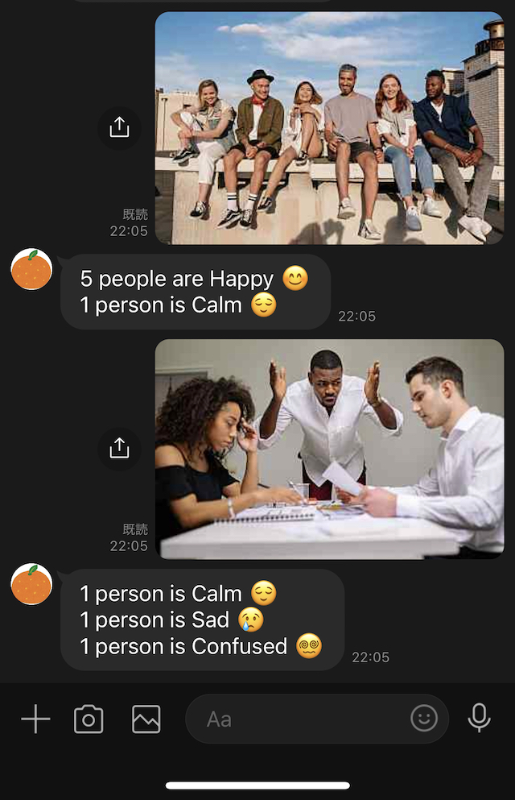

# Preview
<center></center>

**日本語版は下記**

### English

# Emotion-analysis LINEbot
 
## Introduction
This is a LINEbot that returns people's emotions based on a picture you send.
It uses [Amazon Rekognition](https://aws.amazon.com/rekognition/) to detect faces and analyze emotions, and AWS Lambda to create a reply.

## Requirements
- Python 3.8+
- Python 3 Virtual Environment
- pip
- LINE account
- AWS account

## Installation
1. Create and activate a virtual environment
```shell
python3 -m venv venv 
source venv/bin/activate
```
2. Install required dependencies
```shell
pip install -r requirements.txt
```
3. Give appropriate policy to IAM user.

## Usage
1. From your LINE account, send a picture with person/people in it to the bot.
2. Receive a reply.

## Reference
This project is based on Shinji Matsumoto's "[Python と AWS で始める!! 感情分析 AI を使った実践的 LINE Bot 開発入門
](https://www.udemy.com/course/python-aws-ai-line-bot/)" course on Udemy.

### 日本語

# 感情分析LINEbot
 
## Introduction
このLINEbotは、ユーザーが写真を送ると写っている人の感情を分析した結果を受け取ることができます。
顔の認識と感情分析には、[Amazon Rekognition](https://aws.amazon.com/rekognition/) というサービスを使用しています。

## Requirements
- Python 3.8+
- Python 3 Virtual Environment
- pip
- LINE アカウント
- AWS　アカウント

## Installation
1. 仮想環境を作成・開始する。
```shell
python3 -m venv venv 
source venv/bin/activate
```
2. 依存関係をインストールする。
```shell
pip install -r requirements.txt
```
3. IAMユーザーに適切なポリシーを適用する。

## Usage
1. LINEから人の写った写真を選び、bot宛に送信する。
2. botより、分析結果が返信される。

## Reference
本プロジェクトは「 [Python と AWS で始める!! 感情分析 AI を使った実践的 LINE Bot 開発入門
](https://www.udemy.com/course/python-aws-ai-line-bot/) 」という松本真司さんによるUdemyの講座を元に作成しました。
